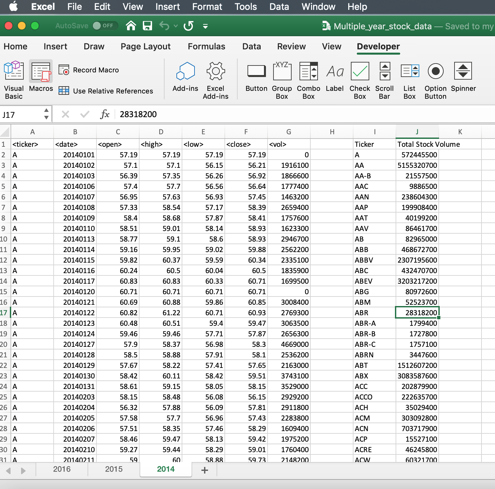

# Stock Market Data

* A VBA script that will loop through one year of stock data for each run and return the total volume each stock had over that year, making sure the script will run on every worksheet, i.e, every year, by running it once

* Displays the ticker symbol to coincide with the total stock volume.

